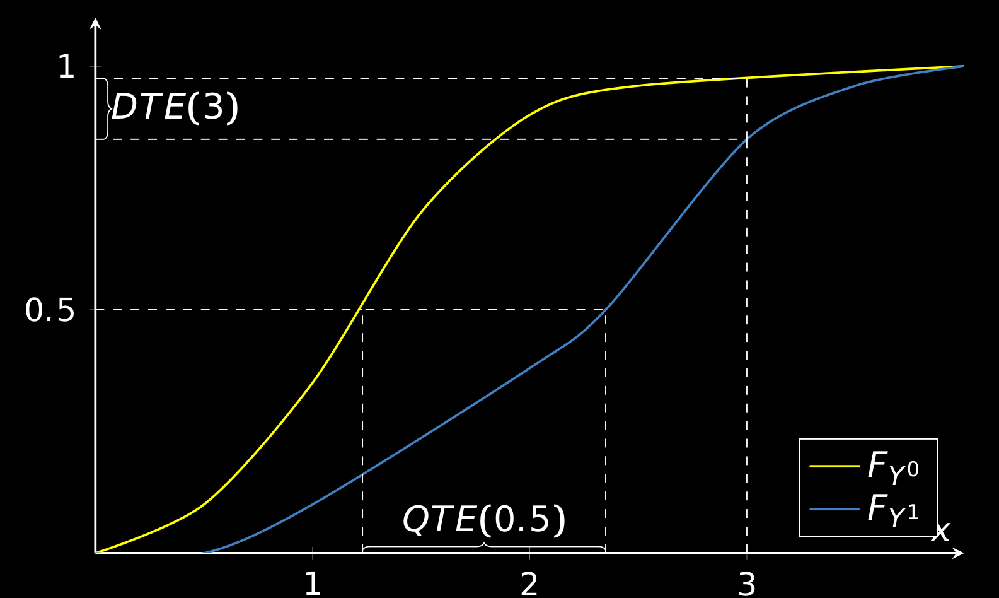

# Econometrics with Unobserved Heterogeneity – Lecture Notes  

## Short Description

This repository contains lecture notes for the course *Econometrics with Unobserved Heterogeneity*, based on a topics course I delivered at the University of Bonn. The notes cover methods for handling unobserved heterogeneity in observational data, including:  

- Linear models with heterogeneous coefficients.
- Nonparametric models with unobserved heterogeneity.
- Quantile and distributional regression.

📖 **Read the lecture notes on my website:** <https://vladislav-morozov.github.io/econometrics-heterogeneity/>

 
 *Selected image: visual representation of distributional treatment effects (DTEs) and quantile treatment effects (QTEs)*

## Contributing & Feedback  
These notes are a work in progress. If you spot typos, errors, or have suggestions, feel free to open an issue or submit a pull request.  

 
